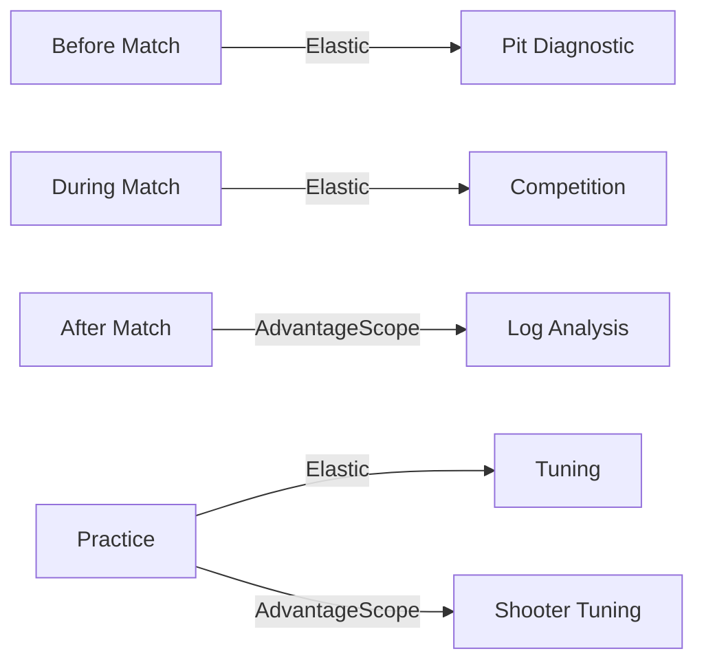

# Dashboards

We have two dashboard tools and they do different things. Elastic is for live matches (driver station monitor), AdvantageScope is for after the match (log replay in the pit).



## Whats in this folder

```
dashboards/
  README.md                              <- you are here
  TESTING_CHECKLIST.md                   <- how to test on the robot
  elastic/                               <- Elastic layouts (live)
    LAYOUTS.md                           <- what each layout does
    rebuilt_driver_competition.json       <- Match + Coach tabs
    rebuilt_pit_diagnostic.json          <- Quick Check + Diagnostics + System Detail
    rebuilt_tuning_session.json          <- Shooter + Subsystems tabs
  advantagescope/                         <- AdvantageScope layouts (post-match)
    LAYOUTS.md                           <- what each layout does
    match_review.json
    cycle_and_strategy.json
    pit_triage.json
    mechanism_debug.json
    power_and_health.json
    drive_and_auto.json
    shooter_tuning.json
    system_overview.json
    vision_debug.json
```

These are all reference copies. Import them into AdvantageScope or Elastic on your laptop -- nothing here gets deployed to the robot.

---

## Elastic Dashboard (3 layouts, 7 tabs total)

This is what shows up on the driver station laptop during matches. Drivers are reading it from 3-6 feet away under match stress, so everything is big and simple.

Check [elastic/LAYOUTS.md](elastic/LAYOUTS.md) for the full widget breakdown and tips.

| Layout | File | Tabs | Who uses it |
|--------|------|------|-------------|
| Competition | `rebuilt_driver_competition.json` | **Match** (10 widgets) + **Coach** (12 widgets) | Driver + coach behind the glass |
| Pit Diagnostic | `rebuilt_pit_diagnostic.json` | **Quick Check** (20) + **Diagnostics** (15) + **System Detail** (19) | Pit crew between matches |
| Tuning | `rebuilt_tuning_session.json` | **Shooter** (26, has RPM graph) + **Subsystems** (19, has current graph) | Programmers during practice |

---

## AdvantageScope (9 layouts)

Post-match log analysis. To load one: **File > Import Layout** and pick a `.json` from `dashboards/advantagescope/`.

Check [advantagescope/LAYOUTS.md](advantagescope/LAYOUTS.md) for details on every tab and what to look for.

### Workflow layouts -- use these between matches

| Layout | File | Tabs | When |
|--------|------|------|------|
| Match Review | [match_review.json](advantagescope/match_review.json) | 5 | After every match -- scoring timeline, 3D field, cycles, driver inputs |
| Cycle and Strategy | [cycle_and_strategy.json](advantagescope/cycle_and_strategy.json) | 5 | Hub shift analysis, cycle timing, intake-to-score pipeline |
| Pit Triage | [pit_triage.json](advantagescope/pit_triage.json) | 4 | Quick health check -- battery, faults, performance |
| Mechanism Debug | [mechanism_debug.json](advantagescope/mechanism_debug.json) | 7 | Shooter/indexer/intake/hanger PID, jams, temps |
| Power and Health | [power_and_health.json](advantagescope/power_and_health.json) | 5 | Brownouts, CAN errors, loop overruns, crash barriers |

### Utility layouts -- focused debugging

| Layout | File | Tabs | Focus |
|--------|------|------|-------|
| Drive and Auto | [drive_and_auto.json](advantagescope/drive_and_auto.json) | 5 | Swerve pose, speeds, path following, gyro, modules |
| Shooter Tuning | [shooter_tuning.json](advantagescope/shooter_tuning.json) | 9 | Velocity curves, PID response, fire rate, recovery time |
| System Overview | [system_overview.json](advantagescope/system_overview.json) | 8 | Battery, CAN, temps, alerts -- general "is anything broken" |
| Vision Debug | [vision_debug.json](advantagescope/vision_debug.json) | 4 | Target lock, latency, camera connectivity, aim offset |

---

## Which dashboard do I open?

If you're standing at the field or in the pit and thinking one of these things, here's where to look.

| You're thinking... | Tool | Open this |
|---------------------|------|-----------|
| Match is about to start | Elastic | Competition > Match tab |
| Coach needs shot counts | Elastic | Competition > Coach tab |
| Quick pit health check | Elastic | Pit Diagnostic > Quick Check |
| Run pre-match diagnostics | Elastic | Pit Diagnostic > Diagnostics |
| Tune shooter PID | Elastic | Tuning > Shooter |
| How did that match go? | AdvantageScope | match_review |
| Are our cycles getting slower? | AdvantageScope | cycle_and_strategy, tab 2 |
| Are we using hub windows well? | AdvantageScope | cycle_and_strategy, tab 4 |
| Shooter stopped spinning mid-match | AdvantageScope | mechanism_debug, tab 1 |
| Indexer kept jamming | AdvantageScope | mechanism_debug, tab 3 |
| We browned out | AdvantageScope | power_and_health, tab 1 |
| CAN errors in driver station log | AdvantageScope | power_and_health, tab 2 |
| Auto path was off | AdvantageScope | drive_and_auto, tab 3 |
| Swerve drifting | AdvantageScope | drive_and_auto, tab 5 |
| Vision kept dropping targets | AdvantageScope | vision_debug |

---

12 dashboards total (3 Elastic with 7 tabs + 9 AdvantageScope layouts) covering about 285 telemetry signals.
