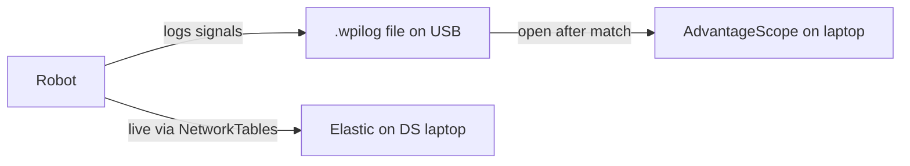
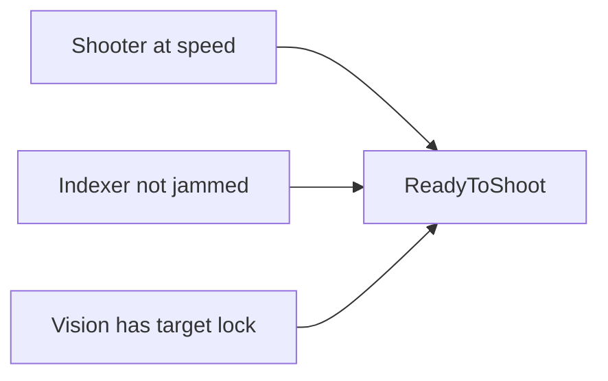

# Testing Checklist

This branch adds telemetry logging and 12 dashboard layouts. The telemetry is read-only (no motor commands, no control logic), so the robot should drive exactly the same as before.



---

## What's new

- 17 telemetry classes that log about 285 signals through SafeLog (crash-isolated so one bad sensor can't take down the whole robot)
- Hub strategy tracking -- shots per hub shift, hub utilization %, active vs inactive hub shots
- Debounced disconnect detection on all motors (filters out CAN bus noise)
- `Scoring/ReadyToShoot` -- a composite signal, explained below
- 12 dashboard layouts (9 for AdvantageScope, 3 for Elastic)

ReadyToShoot is the main signal to watch. It only goes true when all three of these are true at the same time:



If ReadyToShoot is false, check which one of those three isn't happy.

---

## Install the dashboard tools

You need both of these on the driver station laptop. If you already have them, make sure you're on the 2026 versions.

**AdvantageScope** (post-match log viewer):
- Download: https://github.com/Mechanical-Advantage/AdvantageScope/releases
- Grab the latest v26.x `.exe` installer for Windows
- This is what we use in the pit to review match logs

**Elastic Dashboard** (live match display):
- Download: https://github.com/Gold872/elastic-dashboard/releases
- Grab the latest 2026 release for Windows
- This is what goes on the driver station monitor behind the glass

---


## Loading the dashboards

### AdvantageScope

1. Open AdvantageScope
2. To view live: **File > Connect to Robot** (or drag a `.wpilog` file in for post-match)
3. **File > Import Layout**
4. Pick a `.json` from `dashboards/advantagescope/`
5. Good ones to start with:
   - **match_review.json** -- open this after a match to see scoring timeline, field replay, cycle times
   - **pit_triage.json** -- quick health check between matches (battery, faults, temps)
6. The layout loads all the tabs at once. Just click through them.

### Elastic

1. Open Elastic Dashboard
2. It should auto-connect to the robot if you're on the same network (check the connection indicator in the top bar)
3. **File > Open Layout**
4. Pick a `.json` from `dashboards/elastic/`
5. Start with **rebuilt_driver_competition.json** -- it has a Match tab for the driver and a Coach tab for strategy

See `dashboards/README.md` for what all 12 layouts do.

---

## Quick verify (5 min, robot on)

1. Open AdvantageScope and connect to the robot
2. Expand `/RealOutputs/` in the sidebar
3. You should see folders like `Shooter/`, `Drive/`, `Vision/`, `Scoring/`, `SystemHealth/`
4. Check these signals:
   - `Shooter/VelocityRPM` -- should be non-zero when the shooter is spinning
   - `Drive/Pose` -- should update when you push the robot around
   - `SystemHealth/BatteryVoltage` -- should read around 12-13V
   - `Scoring/ReadyToShoot` -- goes true when shooter is at speed + indexer clear + vision locked

If you see all of those, telemetry is working.

---

## Test matrix (10 min)

Run through these with the robot enabled. Check the signals in AdvantageScope as you go.

| # | Test | What to do | What you should see |
|---|------|------------|---------------------|
| 1 | Build | `./gradlew build` | BUILD SUCCESSFUL |
| 2 | Deploy | `./gradlew deploy` | Robot boots, no errors in Driver Station |
| 3 | Drive | Drive around for 30 sec | `Drive/Pose` updates, robot feels normal |
| 4 | Shooter | Spin up the shooter | `Shooter/VelocityRPM` goes up, `Shooter/AtSpeed` goes true |
| 5 | Intake | Run the intake | `Intake/Running` goes true |
| 6 | Vision | Point at an AprilTag | `Vision/HasTarget` goes true |
| 7 | Scoring | Do a full shoot cycle | `Scoring/ReadyToShoot` goes true when everything lines up |
| 8 | Battery | Just check | `SystemHealth/BatteryVoltage` reads a reasonable number |
| 9 | Hub timing | Sit in teleop for a minute | `Scoring/HubShiftNumber` should increment every ~25 seconds |
| 10 | Health | Check after all tests | `Health/Telemetry/Failures` should still be 0 |
| 11 | Dashboard | Import match_review.json into AdvantageScope | All tabs show up and signals populate |
| 12 | Live tuning | Load `rebuilt_tuning_session.json` in Elastic, see below | RPM graph updates live, PID changes take effect immediately |

---

## Try live PID tuning

The Tuning layout in Elastic lets you change PID gains on the fly without re-deploying.

1. Load `rebuilt_tuning_session.json` in Elastic
2. Go to the **Shooter** tab
3. The RPM Graph in the middle shows shooter velocity in real time (5-second rolling window)
4. The kP/kI/kD/FF text fields next to it are **editable** -- type a new value and hit Enter
5. The gain updates instantly on the robot through NetworkTables. You'll see the response change on the graph right away.
6. Same thing works on the **Subsystems** tab for indexer gains, hanger gains, intake speed, and driver deadband

This is way faster than the old edit-build-deploy loop for tuning. Just spin up the shooter, tweak a gain, watch the graph, repeat.

---

## Upload log files for Tamara

After testing, please grab the log file from the roboRIO and upload it so I can review from home.

**Getting the log file:**
```bash
scp admin@10.59.62.2:/home/lvuser/logs/*.wpilog .
```
Or if scp isn't working, connect a USB drive to the roboRIO and copy the `.wpilog` files off it.

**Where to put it:**
Upload to the team Google Drive under `Software/match-logs/`. Name it something like `2026-02-XX_testing_telemetry.wpilog` so I can find it.

I'll review them in AdvantageScope at home and ping you if anything looks off.

---

## If something seems off

| Problem | What to check |
|---------|---------------|
| Robot drives differently | Telemetry is read-only so this shouldn't happen. Check if something else changed. |
| Everything is zeros in AdvantageScope | Check CAN wiring. Try re-deploying. Make sure AdvantageScope is connected. |
| `Health/Telemetry/Failures` is above 0 | Look at `Health/Telemetry/LastFailed` to see which telemetry class is having problems. |
| Loop time over 20ms | Check `SystemHealth/LoopTimeMs`. If it stays high, CAN bus might be overloaded. |
| Dashboard file won't open | Make sure you have AdvantageScope v26+ or Elastic 2026. Older versions won't work. |
