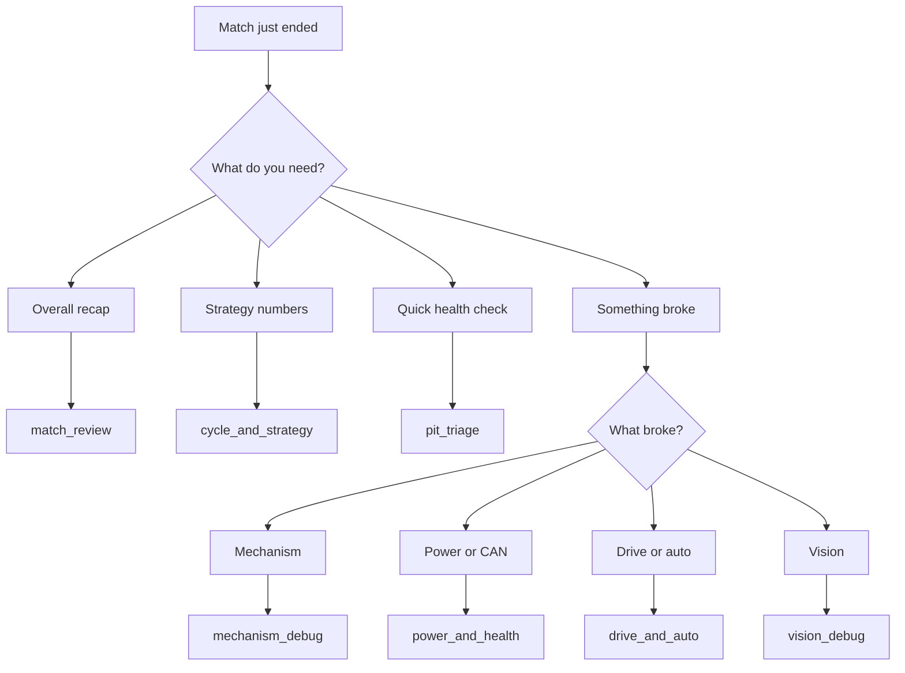
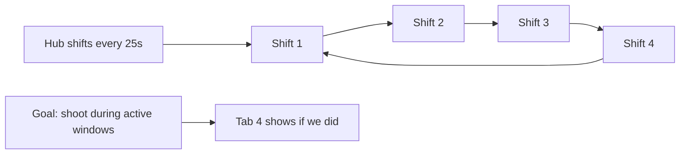
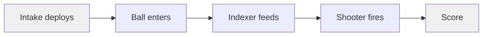

# AdvantageScope Layouts

9 layouts for post-match log analysis. To load one, go **File > Import Layout** and pick the `.json` you want.

They're split into two groups: **workflow** layouts (the ones you'll use between every match) and **utility** layouts (for when you need to dig into something specific).

---

## Workflow Layouts

These are the ones you'll use after most matches.

### match_review.json

Open this first after every match. Takes about 2 minutes to go through.

**Tabs:**
1. **Scoring Timeline** -- shows ReadyToShoot, ShotDetected, AtSpeed, VisionLocked, JamDetected, and HubActive as boolean overlays you can scrub through. Also has TimeToNextShift and HubShiftNumber so you can see exactly when scoring conditions were met or broken.
2. **Field Position** -- 3D field replay of the robot's path. Good for spotting where we got stuck or drifted.
3. **Cycle Performance** -- cycle times and shots-per-minute graphed across the whole match. If cycle times get worse as the match goes on, we might be overheating.
4. **Match Summary** -- battery voltage, cumulative shots, peak current, issue count, active hub shots, and hub utilization %. Look for brownout-to-scoring-dropoff correlation.
5. **Driver Inputs** -- joystick visualization. Double-check the driver was actually commanding what they meant to.

**Things to watch for:**
- ReadyToShoot has gaps -- figure out which sub-condition failed (AtSpeed? VisionLocked? JamDetected?)
- Cycle time trending upward -- probably motor temps or battery sag
- Shots just stopped -- check for jam or shooter stall

---

### cycle_and_strategy.json

This is the hub strategy deep-dive. Use it when you want to know if we're actually scoring during the right hub windows.

**Tabs:**
1. **Hub Strategy** -- HubShiftNumber + TimeToNextShift + TotalShots with HubActive and ReadyToShoot overlays. Shows when hub windows open and how many shots we got in each one.
2. **Cycle Timing** -- last cycle time vs average, shots per minute, completed cycles. Watch for degradation trends.
3. **Intake-to-Score Pipeline** -- full mechanism timeline from intake deploy through indexing to shot. Has boolean stripes for IsDeployed, Running, AtSpeed, ShotDetected, JamDetected. Helpful for figuring out which stage is the bottleneck.
4. **Hub Effectiveness** -- per-shift shot counts (Shift 1 through 4) plus ActiveHubShots vs InactiveHubShots and HubUtilization. This is the tab that answers "are we wasting shots on inactive hubs?"
5. **Scoring Positions** -- 3D field showing where we were scoring from.

**Things to watch for:**
- InactiveHubShots should be 0 -- any shots on inactive hubs are wasted
- Low hub utilization means we weren't at-speed during active windows
- Per-shift imbalance means inconsistent performance across hub rotations
- Long gaps in the pipeline -- figure out if intake, drive, or aim is the bottleneck

---

### pit_triage.json

30-second health check between matches. Load the last match log and flip through these tabs before queueing.

**Tabs:**
1. **Quick Health** -- battery voltage, CAN utilization, loop time with brownout/enabled overlays. One look tells you if things are fine.
2. **Subsystem Faults** -- alert count with boolean stripes for every fault source (shooter stall, indexer jam, intake stall, gyro connected, cameras connected). Immediately shows which subsystem had issues.
3. **Match Performance** -- battery voltage + total shots + health score. Quick summary.
4. **Field Replay** -- 3D field for showing the drive team what happened.

**Things to watch for:**
- Brownout events -- swap the battery
- Disconnected sensors -- check camera/gyro wiring before next match
- Low shot count -- go look at mechanism_debug

---

### mechanism_debug.json

Something mechanical went wrong during the match (missed shots, jams, climb failed). This layout helps figure out what.

Each mechanism gets its own tab so you can look at PID response, current draw, and fault detection independently.

**Tabs:**
1. **Shooter PID** -- target RPM vs actual vs error vs output. The standard PID response plot.
2. **Shooter Health** -- current draw, temperature, shot detection events, stall detection. Look for temp spikes lining up with performance drops.
3. **Indexer** -- target vs actual speed, current, jam detection. Jams show up as a current spike with a speed drop.
4. **Intake** -- velocity and current with Running/Stalled overlays.
5. **Intake Actuator** -- deploy/retract position and current with AtTarget/IsDeployed overlays.
6. **Hanger** -- target vs actual position, error, current. Sluggish = needs more P, overshoot = needs less.
7. **All Motor Temps** -- all 4 mechanism motor temps plus total system current on one graph. Quickly shows which motor is heating up fastest.

**Things to watch for:**
- Shooter error not converging -- PID needs work (switch to shooter_tuning.json for the full tuning setup)
- Current spike with no velocity change -- stall or mechanical jam
- Temps approaching 70C -- need to add cooling time or reduce duty cycle

---

### power_and_health.json

We browned out, had CAN errors, loop overruns, or something weird happened. This is where you go to figure out why.

**Tabs:**
1. **Power Budget** -- battery voltage, brownout state, battery-at-risk prediction, voltage slope. When the slope goes negative fast and voltage is already low, a brownout is about to happen.
2. **CAN Bus** -- utilization and TX/RX error counts. Error spikes usually mean loose wiring or a device dropping off the bus.
3. **Loop Timing** -- loop time in ms and overrun count. Anything over 20ms is a missed cycle.
4. **Thermal Profile** -- all motor temps plus RIO CPU temp on one graph. Lets you spot thermal runaway.
5. **Crash Barriers and Network** -- crash barrier triggers (CommandScheduler, Telemetry, Alerts, Predictive) plus bandwidth warning and hardware connectivity for gyro and cameras. If a barrier goes true, it caught an exception.

**Things to watch for:**
- Voltage drops that line up with mechanism actions -- too much current draw at once, stagger the starts
- CAN errors spiking -- check wiring, make sure the bus is terminated
- Loop time spikes -- check LoggedTracer segments in system_overview to find what's slow
- Any crash barrier firing -- check Diagnostics/Exception/* for the actual error

---

## Utility Layouts

More focused tools for specific debugging tasks.

### drive_and_auto.json

5 tabs: Field Replay (3D), Speed Profile (measured vs requested vX/vY/omega), Path Error (position and heading error with IsFollowing overlay), Gyro Angles (yaw/pitch/roll), Swerve Modules.

Use this for odometry drift, auto path issues, swerve module problems, or if the steering feels off. The requested speeds overlay is good for seeing command-vs-response lag.

### shooter_tuning.json

9 tabs: Velocity vs Target, At Speed Timeline, Motor Output, Temperature, Shot Detection, Spin-Up Time, At Speed %, Fire Rate, Recovery Time.

This is for tuning shooter PID gains during practice. Fire a bunch of shots and compare the response curves across tabs.

### system_overview.json

8 tabs: Battery, CAN, loop timing, LoggedTracer, temperatures, match state (with gyro/camera connectivity overlays), alerts, post-match summary.

General "is anything obviously broken" check. Good starting point if you don't know where to look.

### vision_debug.json

4 tabs: Target Lock (with latency and per-camera connected status), Consecutive Frames, Ready To Shoot Composite, Target Offset (yaw/pitch).

For investigating vision dropouts, high latency, camera disconnects, or aiming offset issues.

---

## Quick reference

| Problem | Open this |
|---------|-----------|
| How'd the match go? | match_review |
| Are cycles getting slower? | cycle_and_strategy, tab 2 |
| Hub strategy working? | cycle_and_strategy, tab 1 |
| Per-shift shot breakdown | cycle_and_strategy, tab 4 |
| Wasting shots on inactive hub? | cycle_and_strategy, tab 4 |
| Intake pipeline bottleneck | cycle_and_strategy, tab 3 |
| Quick pit health check | pit_triage |
| Auto path was wrong | drive_and_auto, tab 3 |
| Swerve drifting | drive_and_auto, tab 5 |
| Shooter not spinning up | mechanism_debug, tab 1 |
| Indexer jammed | mechanism_debug, tab 3 |
| Intake stalled | mechanism_debug, tab 4 |
| Climb was slow or failed | mechanism_debug, tab 6 |
| We browned out | power_and_health, tab 1 |
| CAN errors in DS log | power_and_health, tab 2 |
| Loop overruns | power_and_health, tab 3 |
| Need to tune shooter PID | shooter_tuning |
| Vision kept dropping | vision_debug |
| General health check | system_overview |
