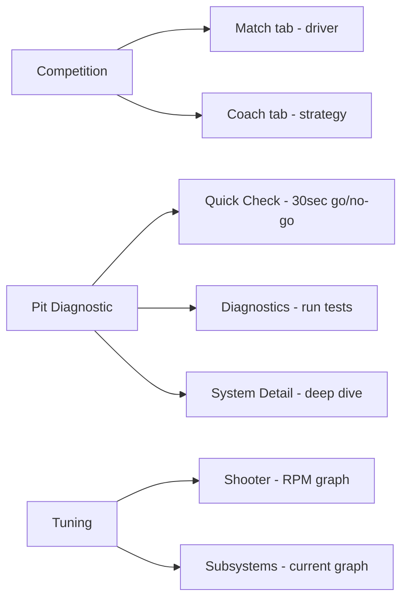

# Elastic Dashboard Layouts

3 Elastic layouts for real-time use on the driver station laptop. Import these into Elastic on your DS laptop; nothing here gets deployed to the robot.



---

## Competition layout

**File:** `rebuilt_driver_competition.json`

This is what's on the driver station monitor during matches. Two tabs: one for the driver, one for the coach.

### Match tab (10 widgets)

The driver reads this from 5+ feet away while driving, so everything is big. The biggest element on screen is the READY TO SHOOT boolean (3x3 green/red box).

| Widget | Type | Size | Signal |
|--------|------|------|--------|
| Match Time | Match Time | 15x1 | Match/Time -- color shifts: blue above 60s, green above 30s, yellow above 15s, red |
| READY TO SHOOT | Boolean Box | 3x3 | Scoring/ReadyToShoot -- biggest thing on screen |
| Camera | Camera Stream | 5x3 | USB Camera 0 |
| Target Lock | Boolean Box | 2x2 | Vision/LockedOnTarget |
| Battery | Voltage View | 5x1 | SystemHealth/BatteryVoltage (8-13V range) |
| Shooter RPM | Number Bar | 5x1 | Shooter/VelocityRPM (0-5700) |
| Hub Active | Boolean Box | 2x1 | Scoring/Conditions/HubActive |
| JAM! | Boolean Box | 5x1 | Indexer/JamDetected -- red when jammed |
| Auto Selector | ComboBox Chooser | 5x1 | Auto Chooser |
| Alerts | Text Display | 10x1 | Alerts/ActiveList |

### Coach tab (12 widgets)

Strategy info for the drive coach -- shot counts, fire rate, hub timing. The Shots Scored widget is a large text display readable from 5+ feet.

| Widget | Type | Size | Signal |
|--------|------|------|--------|
| Match Time | Match Time | 8x1 | Match/Time |
| READY | Boolean Box | 3x2 | Scoring/ReadyToShoot |
| Battery | Voltage View | 4x1 | SystemHealth/BatteryVoltage |
| Shots Scored | Large Text Display | 3x2 | MatchStats/TotalShots |
| Fire Rate | Text Display | 2x1 | MatchStats/ShotsPerMinute |
| Hub Active | Boolean Box | 2x1 | Scoring/Conditions/HubActive |
| Shooter RPM | Number Bar | 4x1 | Shooter/VelocityRPM |
| Total Current | Number Bar | 4x1 | SystemHealth/TotalCurrentAmps |
| Hub Shift | Text Display | 2x1 | Scoring/HubShiftNumber |
| JAM! | Boolean Box | 2x1 | Indexer/JamDetected |
| Auto Selector | ComboBox Chooser | 5x1 | Auto Chooser |
| Alerts | Text Display | 10x1 | Alerts/ActiveList |

v3 split the old single-tab layout into Match + Coach. Battery got upgraded to Voltage View, match time is now color-coded. Removed alliance display (useless) and RP progress (was misleading). Shot count and fire rate moved to the Coach tab.

---

## Pit Diagnostic layout

**File:** `rebuilt_pit_diagnostic.json`

Between matches in the pit, viewed close-up on the driver station laptop. Three tabs going from quick go/no-go to deep system detail.

### Quick Check tab (20 widgets)

30-second go/no-go before queueing. Top row is overall health, middle row is motor temps, bottom is sensors and jams.

| Widget | Type | Size | Signal |
|--------|------|------|--------|
| Health Score | Large Text Display | 3x2 | Summary/HealthScore |
| Battery | Voltage View | 5x1 | SystemHealth/BatteryVoltage |
| Top Issue 1 | Text Display | 7x1 | Summary/TopIssue1 |
| Browned Out | Boolean Box | 2x1 | SystemHealth/BrownedOut |
| Total Current | Number Bar | 3x1 | SystemHealth/TotalCurrentAmps |
| Top Issue 2 | Text Display | 4x1 | Summary/TopIssue2 |
| Top Issue 3 | Text Display | 3x1 | Summary/TopIssue3 |
| Shooter Temp | Number Bar | 3x1 | Shooter/TemperatureCelsius |
| Indexer Temp | Number Bar | 3x1 | Indexer/TemperatureCelsius |
| Intake Temp | Number Bar | 3x1 | Intake/TemperatureCelsius |
| IntakeAct Temp | Number Bar | 3x1 | IntakeActuator/TemperatureCelsius |
| Hanger Temp | Number Bar | 3x1 | Hanger/TemperatureCelsius |
| Gyro | Boolean Box | 2x1 | Drive/Gyro/Connected |
| Left Cam | Boolean Box | 2x1 | Vision/Camera/LeftCam/Connected |
| Right Cam | Boolean Box | 2x1 | Vision/Camera/RightCam/Connected |
| Vision Latency | Text Display | 2x1 | Vision/LatencyMs |
| Idx Jam | Boolean Box | 2x1 | Indexer/JamDetected |
| Int Jam | Boolean Box | 2x1 | Intake/JamDetected |
| CAN Util | Number Bar | 3x1 | SystemHealth/CANUtilization |
| Alerts | Text Display | 15x1 | Alerts/ActiveList |

### Diagnostics tab (15 widgets)

Pre-match diagnostic tests. Hit the trigger buttons and watch pass/fail results.

| Widget | Type | Size | Signal |
|--------|------|------|--------|
| Safe Check | Toggle Button | 3x1 | Diagnostics/TriggerSafe |
| Full Check | Toggle Button | 3x1 | Diagnostics/TriggerFull |
| Running | Boolean Box | 2x1 | Diagnostics/Running -- blue while active |
| Mode | Text Display | 2x1 | Diagnostics/Mode |
| Step | Text Display | 5x1 | Diagnostics/Step |
| ALL PASSED | Boolean Box | 5x2 | Diagnostics/AllPassed -- big green or red |
| Pass/Warn/Fail/Skip counts | 4x Text Display | 2x1 each | Diagnostics/PassCount, WarnCount, FailCount, SkippedCount |
| Gyro Drift | Text Display | 3x1 | Diagnostics/GyroMaxDrift |
| Gyro OK | Boolean Box | 2x1 | Diagnostics/GyroHealthy |
| Vision Drop % | Text Display | 3x1 | Diagnostics/VisionDropoutPct |
| Drive Response | Text Display | 3x1 | Diagnostics/DriveResponseMs |
| Shooter Spinup | Text Display | 3x1 | Diagnostics/ShooterSpinupMs |

### System Detail tab (19 widgets)

Deep dive into bus health, motor currents, and shooter state. Only need this when something looks weird on Quick Check.

| Widget | Type | Size | Signal |
|--------|------|------|--------|
| Battery | Voltage View | 4x1 | SystemHealth/BatteryVoltage |
| CAN Util | Number Bar | 4x1 | SystemHealth/CANUtilization |
| Loop Time | Number Bar | 4x1 | SystemHealth/LoopTimeMs |
| Bandwidth | Number Bar | 3x1 | Network/BandwidthPercent |
| CAN TX/RX | 2x Text Display | 2x1 each | SystemHealth/CANTxErrors, CANRxErrors |
| CAN Off | Boolean Box | 2x1 | SystemHealth/CANBusOff |
| Overruns | Text Display | 2x1 | SystemHealth/LoopOverruns |
| CPU Temp | Number Bar | 3x1 | SystemHealth/RioCPUTemp |
| RSL | Boolean Box | 2x1 | SystemHealth/RSLState |
| BW Warn | Boolean Box | 2x1 | Network/BandwidthCritical |
| Shooter Vel/Tgt | 2x Text Display | 3x1 each | Shooter/VelocityRPM, TargetRPM |
| At Speed | Boolean Box | 2x1 | Shooter/AtSpeed |
| Spinup ms | Text Display | 3x1 | Shooter/SpinUpTimeMs |
| Shots | Text Display | 2x1 | Shooter/TotalShots |
| Shooter/Indexer/Intake Current | 3x Number Bar | 5x1 each | CurrentAmps for each |

v3 split the old 48-widget mega-tab into these 3 tabs. Everything fits on screen now without scrolling.

---

## Tuning layout

**File:** `rebuilt_tuning_session.json`

For practice sessions when you're tuning PID gains. Both tabs have a live Graph widget as the centerpiece.

### Shooter tab (26 widgets)

The RPM Graph (8x3, 5-second window) is the main thing here. PID gain inputs are right next to it so you can tweak and watch the response immediately.

| Widget | Type | Size | Signal |
|--------|------|------|--------|
| RPM Graph | Graph | 8x3 | Shooter/VelocityRPM (5s window, light blue) |
| kP/kI/kD/FF | 4x Text Display (editable) | 2x1 each | SmartDashboard Shooter gains |
| TargetRPM/Tolerance/ShotDrop | 3x Text Display (editable) | 2-3x1 | SmartDashboard Shooter params |
| TUNING MODE | Boolean Box | 4x2 | TuningMode -- green when active, orange when off |
| AT SPEED | Boolean Box | 4x1 | Shooter/AtSpeed |
| Spin Up / Vel Error | Text Display | 2x1 each | SpinUpTimeMs, VelocityError |
| At Speed % | Number Bar | 3x1 | Shooter/AtSpeedPercent (0-120%) |
| Fire rate and recovery widgets | 8x Text/Boolean | 2x1 each | actual/target fire rate, recovery time, velocity drop |
| SHOT! | Boolean Box | 1x1 | Shooter/ShotDetected |
| Motor Temp/Current/Output | 3x Number Bar | 5x1 each | motor health |
| Total Shots | Text Display | 2x1 | Shooter/TotalShots |
| Ready To Shoot | Boolean Box | 4x1 | Scoring/ReadyToShoot |

### Subsystems tab (19 widgets)

Indexer tuning (has its own current graph), plus Hanger, Intake, and Driver tuning params.

| Widget | Type | Size | Signal |
|--------|------|------|--------|
| Indexer Current Graph | Graph | 8x3 | Indexer/CurrentAmps (5s window, orange) |
| Idx kP/kI/kD/FF | 4x Text Display (editable) | 2x1 each | SmartDashboard Indexer gains |
| Idx TgtSpd/JamAmps/JamSec | 3x Text Display (editable) | 2-3x1 | SmartDashboard Indexer params |
| Indexer Jam | Boolean Box | 4x1 | Indexer/JamDetected |
| Idx Actual/Target/Jam Count | 3x Text Display | 3/3/2x1 | Indexer telemetry |
| Hanger kP/kD | 2x Text Display (editable) | 2x1 | SmartDashboard Hanger gains |
| Intake Speed | Text Display (editable) | 2x1 | SmartDashboard Intake speed |
| Vision Yaw/Pitch | 2x Text Display | 3x1 | Vision target angles |
| Deadband / Turn Constant | 2x Text Display (editable) | 3x1 | SmartDashboard Driver params |

v3 split this into two tabs and added the Graph widgets. Can't really tune PID without seeing the time-series response.

---

## Tips

**Making your own layout:** Open Elastic, connect to the robot or sim, drag widgets from the widget list onto the canvas. Right-click a widget to configure it. Save with File > Save Layout.

**Sending alerts from code:**
```java
Elastic.sendNotification(new Notification(
    NotificationLevel.WARNING,
    "Brownout Risk",
    "Battery below 11.5V"
));
```
This pops up in the driver's face -- way more effective than hoping they notice a widget changing color.

**Switching tabs from code:**
```java
Elastic.selectTab("Autonomous");
```

**Competition bandwidth:** Elastic reads from NetworkTables over the field network (4 Mbps limit). Don't publish too much data to NT -- log to USB for AdvantageScope instead.
